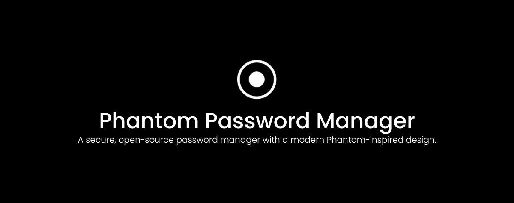

<div align="center">

</div>

<div align="center">
<br>
   


A secure, open-source password manager with a modern Phantom-inspired design.

</div>

## About

Phantom Password Manager is a **100% client-side** password manager. Your data is encrypted with AES-256-GCM in the browser before it's ever stored — meaning no server ever sees your passwords, not even in transit. There is no backend, no cloud sync, and no telemetry. Your vault lives only on your device.

## Features

- **AES-256-GCM Encryption** — All vault data is encrypted in the browser
- **Password Strength Audit** — Real-time strength scoring and crack-time estimates
- **Breach Detection** — Checks passwords against the Have I Been Pwned database
- **TOTP Support** — Built-in 2FA code generation
- **Import/Export** — CSV import from other password managers, encrypted `.pv` backups
- **Auto-Lock** — Configurable inactivity timeout
- **Password History** — Tracks up to 5 previous passwords per item
- **Categories** — Logins, Cards, Notes, and Identity items
- **Folders** — Organize items into custom folders
- **Dark Theme** — Sleek dark UI built with Tailwind CSS

## Privacy

- **Zero-knowledge architecture** — Your master password is never stored or transmitted
- **No backend** — Everything runs in your browser, locally
- **No analytics or tracking** — No cookies, no telemetry, no third-party scripts
- **Encrypted backups** — Export your vault as a `.pv` file that only you can decrypt
- **Open source** — Audit the entire codebase yourself

## Run Locally

**Prerequisites:** Node.js 18+

1. Clone the repository:
   ```bash
   git clone https://github.com/anomalyco/phantom-password-manager.git
   cd phantom-password-manager
   ```
2. Install dependencies:
   ```bash
   npm install
   ```
3. Start the dev server:
   ```bash
   npm run dev
   ```
4. Open `http://localhost:3000` in your browser

## Build for Production

```bash
npm run build
npm run preview
```

## Available Scripts

| Command | Description |
|---------|-------------|
| `npm run dev` | Start dev server on port 3000 |
| `npm run build` | Build for production |
| `npm run preview` | Preview production build |
| `npm run lint` | Run ESLint |
| `npm run lint:fix` | Fix ESLint issues automatically |
| `npm run format` | Format code with Prettier |
| `npm run test` | Run tests in watch mode |
| `npm run test:run` | Run tests once |
| `npm run clean` | Remove build artifacts |

## Tech Stack

- **React 19** + **TypeScript**
- **Vite** — Build tool and dev server
- **Tailwind CSS 4** — Utility-first styling
- **Framer Motion** — Animations
- **crypto-js** — AES-256-GCM encryption
- **otpauth** — TOTP generation
- **zxcvbn** — Password strength estimation
- **Vitest** — Testing framework

## Contributing

Contributions are welcome! Whether it's a bug fix, feature addition, or documentation improvement, feel free to open a pull request.

1. Fork the repository
2. Create a feature branch: `git checkout -b feature/your-feature`
3. Commit your changes: `git commit -m "Add your feature"`
4. Push to the branch: `git push origin feature/your-feature`
5. Open a pull request

## About the Creator

**Michael Ofosu** — Developer & designer.

- Website: [about me (: ](https://michaelofosu.vercel.app)

## License

Apache-2.0
